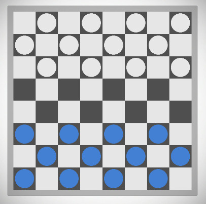

# Draughts Game 2

## Introduction

Draughts or checkers is a classic strategy board game for 2 players. This game uses Genectic Algorithm in the bot player and is made with the game engine Unity v2018.1.6. The number 2 is due the fact that the first version was made with pygame and as the project grows the complexity was incrising too fast. So i started this one.

## Installing

This projects required Unity v2018.1.6 or later. Download and unzip the file wherever you want. Open the Unity, go to 'File'>'Open Project', then select the project folder you just unzip. Hit the play button and enjoy!

## License

[GNU GPLv3](https://www.gnu.org/licenses/gpl-3.0.pt-br.html)
